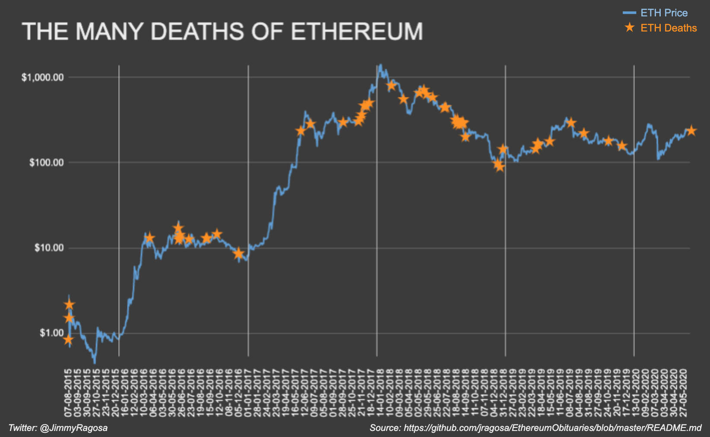

# Ethereum Obituaries
A curated list of Ethereum Obituaries.

### Contributing
Please take a quick look at the [contribution guidelines](https://github.com/jragosa/EthereumObituaries/blob/master/Contribution.md) first. Thanks to all contributors! 

*If you see a link here that is wrong or broken, please submit a pull request to improve this file. Thank you!*

## Ethereum has died **57** times so far.

### Timeline
 - [2014](#2014)
 - [2015](#2015)
 - [2016](#2016)
 - [2017](#2017)
 - [2018](#2018)
 - [2019](#2019)
 - [2020](#2020)

## The List
### 2014
- Apr 09 - [Sidechains: the coming death of altcoins and ethereum.](https://letstalkbitcoin.com/e99-sidechain-innovation) - `Adam Back` - *Let's Talk Bitcoin* - **Not Launched**
- Oct 15 - [Why Ethereum is dead in the water.](https://bitcointalk.org/index.php?topic=824220.10) - `Rabbiter` - *Bitcointalk* - **Not Launched**
### 2015
 - Dec 25 - [Maybe it is too late to save Ethereum](https://www.wallstreettechnologist.com/?p=771) - `Digitsu` - *Wall Street Technologist* - **$0.88**
### 2016
 - Mar 09 - [Why your Ethereum project will most likely fail](https://medium.com/@bedeho/why-your-ethereum-project-will-most-likely-fail-d14b6d8f1c7c#.2ncy6qz5l) - `Bedeho Mender` - *Medium* - **$11.97**
 - Mar 28 - [Ethereum Can’t Work, it’s 100% Hype](http://www.newsbtc.com/2016/03/28/counterparty-founder-ethereum-cant-work-100-hype/) - `Chris DeRose` - *NewsBTC* - **$11.53**
 - Jun 17 - [The Fundamental Problems with Ethereum](https://medium.com/@beautyon_/the-fundamental-problems-with-ethereum-408c420849f0#.9fc7v8qt3) - `Beautyon` - *Medium* - **$14.85**
 - Jun 18 - [R.I.P Ethereum - The Pre-Mined ScamCoin is dead](https://bitcointalk.org/index.php?topic=1516545.0) - `Portalufonet` - *Bitcointalk* - **$14.98**
 - Jun 20 - [Ethereum is Doomed](http://nakamotoinstitute.org/mempool/ethereum-is-doomed/#selection-323.271-327.310) - `Daniel Krawisz` - *Nakamoto Institute* - **$14.13**
 - Jun 21 - [Ethereum fights for its survival after $50 million heist](http://arstechnica.com/security/2016/06/bitcoin-rival-ethereum-fights-for-its-survival-after-50-million-heist/) - `Dan Goodin` - *Ars Technica* - **$11.82**
 - Jul 17 - [Ether/DAO Hack: Is Ethereum Dead?](http://cryptocrooks.com/dao-ether-hack-ethereum-dead/#.W4Qnoej-g2w) - `Michael` -  *CryptoCrooks* - **$11.35**
 - Sep 04 - [The Bizarre Fallout of Ethereum’s Epic Fail](http://fortune.com/2016/09/04/ethereum-fall-out/) - `David Z. Morris` - *Fortune* - **$11.76**
 - Sep 07 - [How Bitcoin Succeeded Where Ethereum Failed](http://coinjournal.net/bitcoin-succeeded-ethereum-failed/) - `Kyle Torpey` -  *CoinJournal* - **$11.58**
 - Oct 05 - [Why I’m short Ethereum (and long Bitcoin)](https://medium.com/@tuurdemeester/why-im-short-ethereum-and-long-bitcoin-aee5b1c198fd#.kwfrait73) - `Tuur Demeester` -  *Medium* - **$13.22**
 - Dec 04 - [ETH is dead (from an investor perspective)](https://imgur.com/a/HFMBk#I1ZtMxs) - `Barry Silbert` - *ETC Slack* - **$7.60**
 - Dec 06 - [Ethereum In Free Fall As Floor Beneath It Drops](https://cointelegraph.com/news/ethereum-in-free-fall-as-floor-beneath-it-drops) - `Shivdeep Dhaliwal` - *Cointelegraph* - **$7.58**
 
### 2017
- Jun 01 - [Why Will Ethereum Fail?](https://steemit.com/ethereum/@joseph/why-will-ethereum-fail#@thecryptofiend/re-joseph-why-will-ethereum-fail-20170601t212114290z) - `Joseph` - *Steem* - **$235.16**
- Jun 27 - [Top 5 Reasons Why Ethereum Will Fail — Maybe](https://bitsonline.com/top-5-reasons-ethereum-fail/) - `Evan Faggart` - *Bitsonline* - **$271.00**
- Sep 28 - [Is Ethereum Doomed To Fail?](http://www.digitalmarketingcasestudies.com/2017/09/28/ethereum-doomed-fail/) - `Portushead` - *Digital Marketing Case Studies* - **$304.77**
- Nov 10 - [ETH (ETHEREUM) IS DEAD](https://steemit.com/bitcoin/@juniusmaltby/eth-ethereum-is-dead) - `Juniusmaltby` - *Steem* - **$318.19**
- Nov 16 - [The Neverending Ethereum Disaster](https://robertmcgrath.wordpress.com/2017/11/16/the-neverending-ethereum-disaster/) - `Robert McGrath`- *Robert McGrath's blog* - **$328.52**
- Nov 20 - [Why the Ether Cryptocurrency will Fail in 2018](https://oracletimes.com/ethereum-is-doomed-why-the-ether-cryptocurrency-will-fail-in-2018/) - `Techno Rajji` - *OracleTimes* - **$362.95**
- Nov 26 - [Parity Hack Shows the Ethereum Ecosystem Is Flawed in Big Ways](https://nulltx.com/parity-hack-shows-the-ethereum-ecosystem-is-flawed-in-big-ways/) - `JP Buntinx`- *NullTX* - **$462.49**
- Dec 04 - [CryptoKitties Is Totally Wrecking the Ethereum Network](https://www.bitsonline.com/cryptokitties-wrecking-ethereum/) - `Tyson O'Ham` - *Bitsonline* - **$462.44**
- Dec 11 - [Reasons Why Ethereum Could Be Doomed](https://globalcoinreport.com/reasons-why-ethereum-could-be-doomed/) - `Brianna Browning` - *GlobalCoinReport* - **$588.32**

### 2018
- Mar 18 - [Ethereum price drop today: Is ethereum dead?](https://www.express.co.uk/finance/city/932168/Ethereum-price-drop-today-is-ethereum-dead-will-cryptocurrency-go-back-up) - `Vickiie Oliphant` - *Daily Express* - **$520.30**
- May 02 - [Can Ethereum (ETH) Survive Regulatory Scrutiny?](https://cryptodaily.co.uk/2018/05/can-ethereum-eth-survive-regulatory-scrutiny/) - `Fakhan` - *Cryptodaily* - **$680.18**
- May 15 - [Ethereum is officially dead](https://bitcointalk.org/index.php?topic=3299849.720) - `Straimrpl777`- *Bitcointalk* - **$732.28** 
- May 23 - [Ethereum size has exceeded 1TB, and yes, it’s an issue](https://hackernoon.com/the-ethereum-blockchain-size-has-exceeded-1tb-and-yes-its-an-issue-2b650b5f4f62) - `StopAndDecrypt` - *Hackernoon* - **$633.36**
- Jun 09 - [Everything about EOS, the 'Ethereum Killer'](https://hackernoon.com/everything-they-dont-want-you-to-know-about-eos-the-ethereum-killer-9939c43aa2df) - `Thijs Maas` - *Hackernoon* - **$605.90**
- Jul 11 - [What if Ethereum is Just an Evolutionary Stepping Stone?](https://hackernoon.com/what-if-ethereum-is-just-an-evolutionary-stepping-stone-450a710f46c) - `Jon Creasy` - *Hackernoon* - **$440.06**
- Jul 16 - [Ether Bearish Thesis: The “Flippening” of Market Irrationality](https://medium.com/@tetrascapital/ether-eth-bearish-thesis-the-flippening-of-market-irrationality-8633e70ab498) - `Tetras Capital` - *Medium* - **$448.95**
- Aug 12 - [The Ethereum death spiral is just beginning](https://twitter.com/realpauleverton/status/1028699619763531776) - `Paul Everton` - *Twitter* - **$327.07**
- Aug 17 - [Is Ethereum (ETH) dominance at stake?](https://cryptoglobalist.com/2018/08/17/last-winner-game-jams-ethereum-network-is-ethereum-eth-dominance-at-stake/) - `Nick Mwenda` - *Cryptoglobalist* - **$298.58**
- Aug 20 - [Ether, A Double Digit Shitcoin](https://blog.bitmex.com/ether-a-double-digit-shitcoin/) - `Arthur Hayes` - *BitMex Blog* - **$301.95**
- Aug 24 - [Ethereum is a dead coin walking.](https://twitter.com/AnselLindner/status/1033120662121054213) - `Ansel Lindner` - *Twitter* - **$277.84**
- Aug 24 - [It’s the end of Ethereum.](https://coingeek.com/the-attack-continues-vitalik-buterin-wants-bch-community-to-ostracize-craig-wright/) - `Dan Taylor` - *Coingeek* - **$277.84**
- Aug 30 - [Ethereum: A broken engine?](https://www.taurusgroup.ch/ethereum-a-broken-engine/) - `Taurus Group SA` - *Taurus Group SA* - **$284.92**
- Sep 02 - [ETH Futures: Bad for Ethereum, Good for Bitcoin, says Tom Lee](https://bitcoinist.com/eth-futures-ethereum-bitcoin-tom-lee/) - `Tom Lee` - *Bitcoinist* - **$295.32**
- Sep 02 - [The Collapse of ETH is Inevitable](https://techcrunch.com/2018/09/02/the-collapse-of-eth-is-inevitable/) - `Jeremy Rubin` - *Techcrunch* - **$294.86**
- Sep 04 - [Ethereum’s Demise as a Cryptocurrency is Foreseeable](https://medium.com/futuresin/ethereums-demise-as-a-cryptocurrency-is-foreseeable-d9240dcc061e) - `Michael K. Spencer` - *Medium* - **$224.23**
- Sep 10 - [The Death of Ethereum](https://www.linkedin.com/pulse/death-ethereum-mujeeb-lawal/) - `Mujeeb Lawal
`- *LinkedIn* - **$198.32**
- Dec 10 - [Hard Fork Could Spell Doomsday for Ethereum](https://cryptoiq.co/falling-prices-increasing-regulation-causing-crypto-hedge-funds-to-shut-down/) - `Zachary Mashiach` - *Crypto.IQ* - **$94.48**
- Dec 17 - [The Fall of Ethereum](https://medium.com/futuresin/the-fall-of-ethereum-15c4b64467d8) - `Michael K. Spencer` - *Medium* - **$85.50**
- Dec 25 - [ICOs and Ethereum Are Dead](https://digitalmarkettoday.com/4-words-in-2018-icos-and-ethereum-are-dead/) - `Digital Marketplace` - *Digital Market Today* - **$131.28**

### 2019
- Mar 28 - [Ethereum Is Losing Its Luster And Its Market Share](https://www.bloomberg.com/news/articles/2019-03-28/better-version-of-bitcoin-loses-luster-as-apps-move-elsewhere) - `Olga Kharif` - *Bloomberg* - **$140.42**
- Apr 03 - [Is Ethereum’s market share at risk from EOS and TRON?](https://cryptoslate.com/is-ethereums-market-share-at-risk-from-eos-and-tron/) - `Priyeshu Garg` - *CryptoSlate* - **$173.13**
- Apr 05 - [Ethereum: Running Out of Gas](https://medium.com/@HASHCIB/ethereum-running-out-of-gas-697b49b07e73) - `Rustam Botashev & Mikhail Butov` - *Medium* - **$158.21**
- Jun 07 - [Ethereum is among crypto's deadwood](https://www.bloomberg.com/opinion/articles/2019-06-07/cryptocurrency-winners-are-starting-to-emerge) - `Aaron Brown` - *Bloomberg* - **$249.53**
- Jul 07 - [The Ethereum Killer Is Already Here](https://www.ccn.com/op-ed/ethereum-killer-is-binance/2019/07/07/) - `Greg Thompson` - *CCN* - **$307.69**
- Aug 12 - [Chances of ETH ever getting over $500 again are virtually zero](https://twitter.com/maxkeiser/status/1160897404809424898) - `Max Keiser` - *Twitter* - **$211.87**
- Oct 21 - [When Will Bitcoin Sidechains Send Ethereum Price To Zero?](https://www.forbes.com/sites/ktorpey/2019/10/21/when-will-bitcoin-sidechains-send-ethereum-ripple-and-other-crypto-prices-to-zero/amp/?__twitter_impression=true) - `Kyle Torpey` - *Forbes* - **$174.51**
- Nov 27 - [By 2021 you'll have forgotten ethereum was a thing.](https://twitter.com/jebus911/status/1199540720496984065?s=09) - `Jeremy Ross` - *Twitter* - **$149.05**

### 2020
- Feb 25 - [It’s “Game Over” for Ethereum](https://www.newsbtc.com/news/ethereum/its-game-over-for-ethereum-as-violent-selloff-leads-it-below-do-or-die-level/) - `Cole Petersen` - *NewsBTC* - **$265.24**
- Jun 12 - [ETH is a poor store of value & a terrible crypto](https://medium.com/@ExponentialIM/ether-and-bitcoin-are-not-the-same-e5932b510821) - `Steven McClurg & Leah Wald` - *Medium* - **$232.76**
- Jul 16 - [Death of Fat Protocol Thesis Is Bearish for Ethereum](https://cryptobriefing.com/death-fat-protocol-thesis-is-bearish-ethereum/) - `Ashwath Balakrishnan` - *Cryptobriefing* - **$238.66**
- Sep 07 - [Ethereum is a dead chain limping](https://coingeek.com/ethereum-is-a-dead-chain-limping/) - `Mohammad Jaber` - *Coingeek* - **$357.92**
- Sep 11 - ["Binance Chain" launched & it's a drop-in replacement for ETH.](https://twitter.com/fluffypony/status/1304379141903577089) - `Riccardo Spagni` - *Twitter* - **$368.18**

